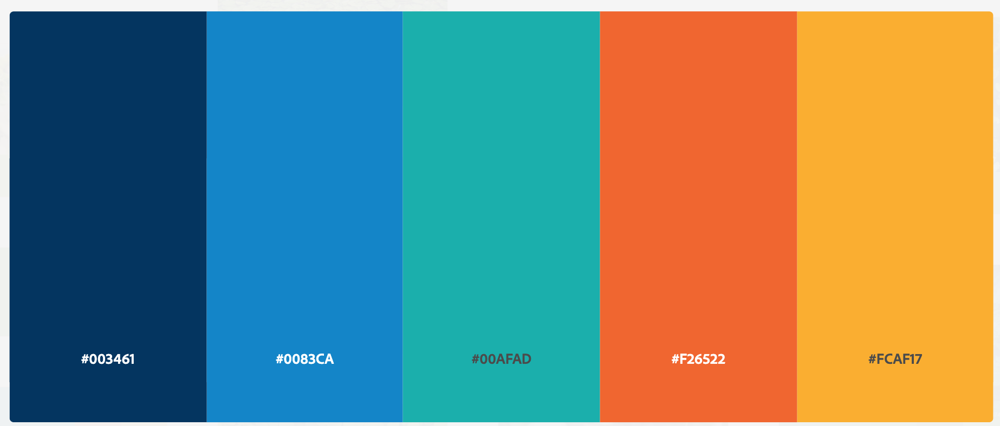

# Design Challenge 20201215

## Introdução

Este é um desafio para testar seus conhecimentos de Design e Prototipação;

Neste desafio existem várias formas de desenvolver e obter os resultados propostos. O objetivo é avaliar a sua forma de estruturação e autonomia em decisões para construir algo escalável.

## Desafio / Case

A empresa Trevo Digital atua com diversos clientes a nível global em mais de 15 países, uma das principais características da empresa é o forte posicionamento no setor digital com uma equipe focada na geração de leads de qualidade.
Por isso, todos os projetos devem ser muito bem estruturados pensando em SEO, fluidez e reuso (componentes reutilizados em vários projetos).
O seu objetivo é criar um projeto que dê atenção aos requisitos anteriormente mencionados.

## Recursos

1. Utilizar alguma ferramenta de design online de colaboração. Ex: Figma

## Passo a Passo

Neste desafio trabalhamos na elaboração de uma estrutura inicial do Design System e no desenvolvimento de dois protótipos mobile e web das telas do projeto de e-commerce da um Cliente da Trevo Digital.

Antes de começar a trabalhar, a equipe de análises e requisitos desenvolveu o WireFrame inicial da versão mobile do projeto:

Para trabalhar o protótipo, devemos seguir a paleta de cores que o cliente enviou:

### Design System

O Design System do projeto será um esboço inicial com:

- Tipos de Fontes
- Cores
- Componentes

### Versão Mobile

Para desenvolver as telas do Mobile, devemos revisar se a UI e UX está correta antes de trabalhar no protótipo. Com seus conhecimentos, revise a proposta e aplique as devidas correções que você achar necessária para melhorar a usabilidade do projeto.

### Versão Desktop

Não foi desenvolvido proposta de Wireframe para versão desktop, por isso deveremos elaborá-la seguindo a estrutura da versão mobile, mas aplicando os devidos ajustes para a nova versão.

Alguns elementos importantes que temos na versão mobile:

- Imagem produto
- Título
- Valoração
- Preço
- Botão de mais opções

> Dica: Uma diferença entre as versões seria a paginação.

### Extras

- **Diferencial 1** Criar a proposta visual do Single de produto
- **Diferencial 2** Prototipar o Modal de valoração na versão Desktop

## Readme do Repositório

- Deve conter o título do projeto
- Uma descrição de uma frase
- Instruções em geral e exports dos elementos do projeto
- Não esqueça o [.gitignore](https://www.toptal.com/developers/gitignore)

## Finalização

Avisar sobre a finalização e enviar para correção em: [https://coodesh.com/review-challenge](https://coodesh.com/review-challenge)
Após essa etapa será marcado a apresentação/correção do projeto.

## Instruções para a Apresentação:

1. Será necessário compartilhar a tela durante a vídeo chamada;
2. Deixe todos os projetos de solução previamente abertos em seu computador antes de iniciar a chamada;
3. Prepara-se pois você será questionado sobre cada etapa e decisão do Challenge;
4. Prepare uma lista de perguntas, dúvidas, sugestões de melhorias e feedbacks (caso tenha).

## Suporte

Use o nosso canal no slack: http://bit.ly/32CuOMy para tirar dúvidas sobre o processo ou envie um e-mail para contato@coodesh.com.
